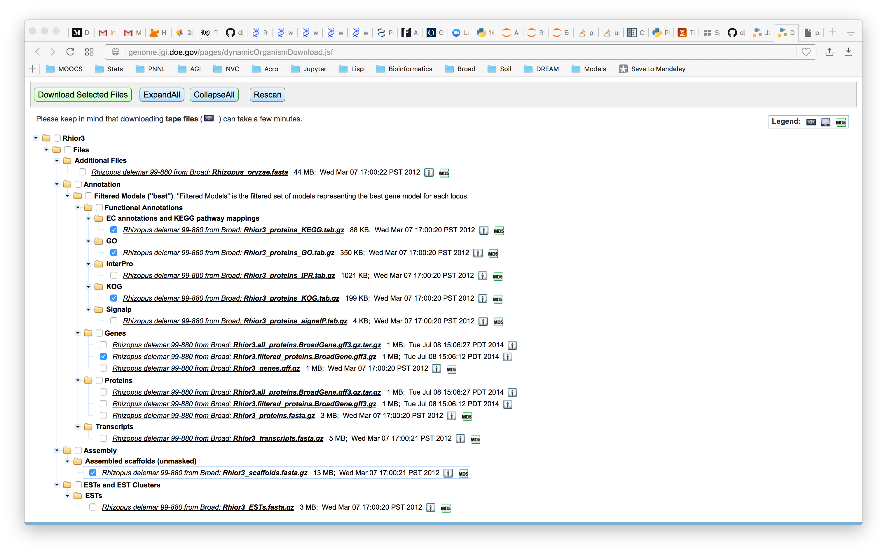
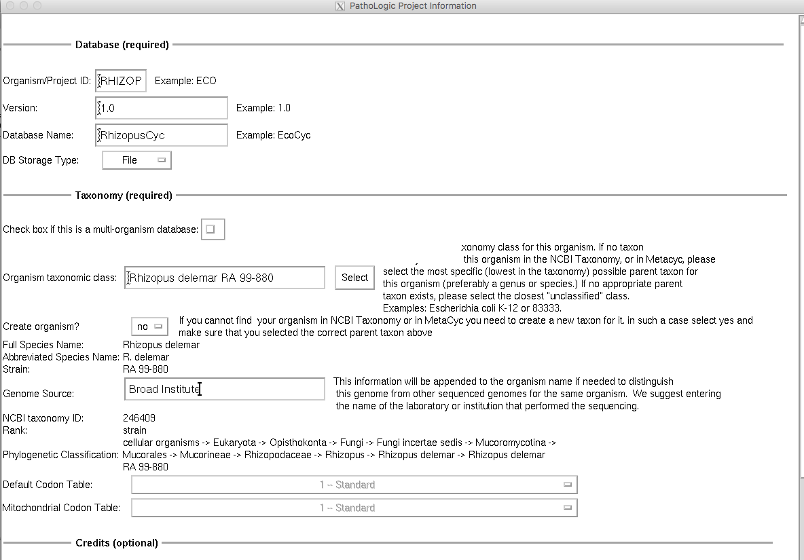

# annot2pathologic

## Prerequisites

For this to work, you must install the following packages:

```
conda install -c bioconda biopython
conda install -c bioconda gffutils
conda install pandas numpy
```

## Installation

```
cd ~/
git clone https://github.com/djinnome/annot2pathologic.git
```

## Usage


```
annot2pathologic/annot2pathologic.py --help
usage: annot2pathologic.py [-h] [--gff GFF] [--gtf GTF] [--ec EC] [--kog KOG] [--go GO] [--seq SEQ] [--mapfile MAPFILE] [--outputdir OUTPUTDIR]

Convert annotations to Pathologic file format

optional arguments:
  -h, --help            show this help message and exit
  --gff GFF             input gff file name
  --gtf GTF             input gtf file name
  --ec EC               input EC number annotations file name
  --kog KOG             input kog annotations file name
  --go GO               input go annotations file name
  --seq SEQ             input (unmasked) sequence file
  --mapfile MAPFILE     map from GFF to Annotation IDs (default is protein_id)
  --outputdir OUTPUTDIR output directory
```

## Example invocation

* Assume you have downloaded the annotation and assembly of [Rhizopus delemar  99-880](http://genome.jgi.doe.gov/pages/dynamicOrganismDownload.jsf?organism=Rhior3)


* Assume you have initialized a Pathway/Genome database named rhizopuscyc using Pathologic. `Tools->Pathologic->Database->Create new`



```
unzip ~/Downloads/Rhior3_download.zip
cd Rhior3
gunzip *.gz
~/annot2pathologic/annot2pathologic.py \
    --gff Rhior3.filtered_proteins.BroadGene.gff3 \
    --ec Rhior3_proteins_KEGG.tab \
    --kog Rhior3_proteins_KOG.tab \
    --go Rhior3_proteins_GO.tab \
    --seq Rhior3_scaffolds.fasta \
    --outputdir ~/ptools-local/pgdbs/user/rhopuscyc/1.0/input
```


* You are now ready to go to `Build->Specify Replicons`


## Future work
* Generate an organism.dat file from the NCBI taxonomy that will allow you to run pathologic from the command-line, rather than invoking pathway-tools.
* Require only pointing to the base directory of a Mycocosm download, and annot2pathologic.py will find all the appropriate annotation files automagically.
* Require only pointing to the base URL of a Mycocosm download, and annot2pathologic.py will download the files it needs and convert them to pathologic file format automagically.